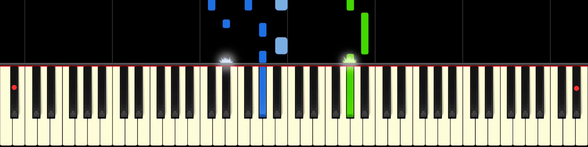

# piano-video-to-midi
A Python program that scans piano videos (like from Synthesia) and converts them to MIDI.

# Usage
First you need to install the following software:

  * [ffmpeg](https://ffmpeg.org/)
  * [python3](https://www.python.org/) (obviously)

Then the following PIP packages:

  * ffmpeg-python
  * pillow
  * py_midicsv

After installing the dependencies you need to obtain a video. (possible with [youtube-dl](https://youtube-dl.org/))

Create a file called config.py and put this code in it:

```python
# Video Parameters
filename = ""
height = 1080
width = 1920
framerate = 60

# Time when playing starts and ends
starttime = 
endtime = 

# Tempo and volume
bpm = 
velocity = 

# Key mapping
keysY = 
leftkeyX = 
rightkeyX = 
leftkeyPitch = 
rightkeyPitch = 
```

Edit config.py to include the parameters of your video, the time in seconds at which the playing starts and stops, the tempo and the desired note velocity.

Then you'll need to edit the key mapping according to your video. Take a screengrab and use a program like [GIMP](https://www.gimp.org/) to get the screen coordinates of two keys on the far ends of the piano. (marked with red dots in example below)



Set `keysY` to the y-coordinate of the middle of the black keys, and `leftkeyX` and `rightkeyX` to x-coordinate of the left and right key respectively. Then set their pitches to the numbers on the keys from this helpful chart:


Run the python script:

    python3 script.py

The created midi file will be named `output.mid`.
